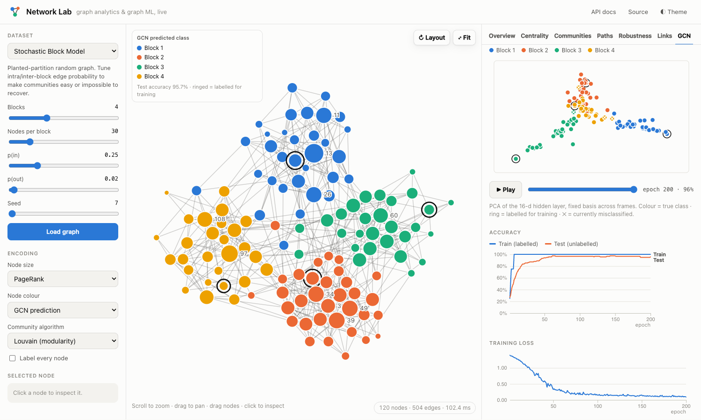
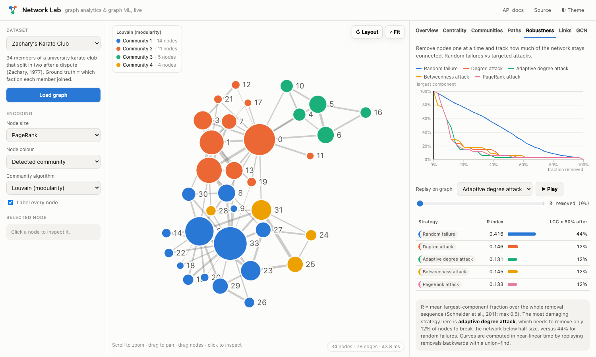

# Network Lab

An interactive web app for **network analysis and graph machine learning**. You can load a real-world or synthetic network (or paste your own edge list) and explore it through centrality, community detection, shortest paths, attack simulations, supervised link prediction, and a Graph Convolutional Network written from scratch in NumPy.

**Stack:** Python · FastAPI · NetworkX · NumPy/SciPy · scikit-learn · D3.js. There is no frontend build step, and it deploys to Render with one file.

https://network-lab-ybxh.onrender.com

## What it does

| Tab | What's inside |
|---|---|
| **Overview** | Density, clustering, assortativity, path length and diameter, plus the degree distribution. It computes the small-world coefficient σ against an Erdős–Rényi baseline. |
| **Centrality** | Degree, betweenness, closeness, eigenvector, PageRank, k-core and local clustering. Each can drive node size. A Spearman rank-correlation matrix shows where the measures disagree, which flags broker nodes. |
| **Communities** | Louvain, Clauset–Newman–Moore, label propagation, and a hand-written **normalised spectral clustering** (Ng–Jordan–Weiss, with k picked by the eigengap). Each partition is scored with modularity, plus NMI and ARI against ground truth. A benchmark table compares every algorithm on the same graph. |
| **Paths** | All shortest paths between two clicked nodes, unweighted (BFS) or weighted (Dijkstra with cost = 1/tie strength). |
| **Robustness** | Random failure vs degree, adaptive-degree, betweenness and PageRank attacks. Shows largest-component curves and the Schneider *R* index, with a scrubber that replays the attack on the graph. |
| **Link prediction** | Seven heuristics (CN, Jaccard, Adamic–Adar, resource allocation, preferential attachment, Katz, low-rank spectral) compared with a learned model. Reports ROC-AUC, average precision, ROC curves, permutation importance and precision@k, and draws the top predictions on the graph. |
| **GCN** | A 2-layer GCN (Kipf & Welling 2017) in pure NumPy: forward pass, **hand-derived backprop**, and Adam. It is compared with harmonic label propagation and spectral-embedding logistic regression, reports mean ± std over 10 label splits, and animates the hidden-layer embedding as it trains. |



## Engineering details

- **Leakage-safe link prediction.** The code runs two nested edge hold-outs. Training-pair features come from a graph with those edges removed, and test-pair features come from a graph that never contained the test edges. A test asserts that no scored pair appears in the graph its features were computed on.
- **Gradient-checked backprop.** The GCN gradients are verified against central finite differences in `tests/test_core.py`.
- **Near-linear robustness curves.** Computing the largest component after each removal naively costs O(n·(n+m)). Instead, the code replays the removal order backwards as node *additions* with a union-find, which gives the whole curve in near-linear time. A test checks it against brute force.
- **Vectorised features.** All pair features come from dense matrix algebra. One eigendecomposition gives both the Katz index (`V diag(1/(1−βλ) − 1) Vᵀ`) and the low-rank reconstruction score.
- **Adaptive model choice.** Small graphs don't have enough positive pairs for tree ensembles, so the pipeline switches between a regularised logistic regression on log-scaled features and gradient-boosted trees.
- **Honest baselines.** Every ML result sits next to simple baselines, including a majority-class guess. Harmonic label propagation includes class mass normalisation (Zhu et al. 2003) so the baseline isn't a straw man.
- **Scaling guards.** Graphs are capped at 2k nodes / 20k edges. Betweenness and path statistics switch to sampling above 600 nodes, and CPU-bound work runs off the event loop.



## Run locally

```bash
make install     # creates .venv and installs dependencies
make dev         # http://localhost:8000
make test        # 19 tests
```

Without `make`:

```bash
python3 -m venv .venv && source .venv/bin/activate
pip install -r requirements-dev.txt
uvicorn app.main:app --reload
```

Interactive API docs are served at `/docs`. Deep links work too, e.g. `/#dataset=sbm&tab=gcn`.

## Deploy to Render

1. Push this repo to GitHub.
2. In Render, choose **New → Blueprint** and select the repo. `render.yaml` sets up the service (free plan, health check at `/api/health`).
3. Wait for the build to finish. Your URL will be `https://network-lab-XXXX.onrender.com`.

Free Render instances sleep when idle, so the first request after a while takes ~30 s to wake up.

## Bring your own graph

Choose **Your Edge List** and paste one edge per line: `source,target[,weight]`. To enable NMI/ARI scoring and the GCN tab, add ground-truth labels:

```
alice,bob
bob,carol,2.5
carol,dave
# labels
alice,red
bob,red
carol,blue
dave,blue
```

## Project layout

```
app/
  datasets.py         built-in graphs, generators, edge-list parser
  analysis.py         stats, centrality, communities, paths, robustness
  link_prediction.py  leakage-safe split, pair features, model + evaluation
  gcn.py              NumPy GCN, Adam, baselines, multi-split benchmark
  main.py             FastAPI routes
static/               index.html, style.css, js/ (D3 graph view, charts, app)
tests/                unit + API tests
render.yaml           Render blueprint
```
